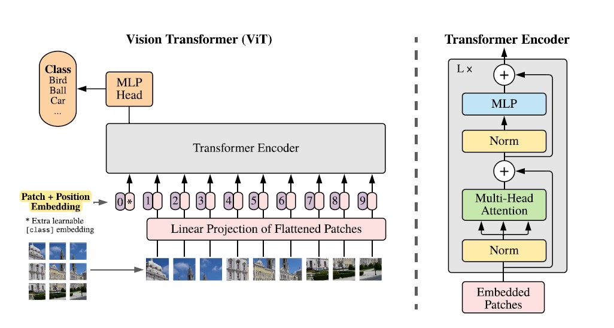

# ViT_pytorch
Coding a vision transformer from scratch using python's pytorch framework.
The Vision Transformer Architecture:



Let's break down the subparts of the transformer...

* Initial patch embeddings: The input image is broken down into distinguishable patches of size nxn (n=16) and these patches are embedded using convolutional layers.
 
* Conversion to projected vectors: These patches are then converted to key, query and value projection vectors using linear layers

* Attention blocks: Consist of the self-attention layers to assign weights and context to patches

* Multi layer perceptron: A simple network with linear layers for image classification. Uses Gaussian Error Linear Rectified Unit activation.

* Final classification layer: Linear layer which maps the output to respective class probabilities.


## Inference
The vision transformer can be used in inference mode as from the file inference.py with necessary arguments. The result will be of the shape: (batch_size, nclasses) and can be changed to suit the application involved. The model and inputs can be sent to a pre-existing GPU using PyTorch's cuda capabilities.

Run
```python
python inference.py --depth --projp --attnp --gpu --wts
```

## Dependencies
* PyTorch (preferable with CUDA integration)
* numpy
* OpenCV for optional image upload
